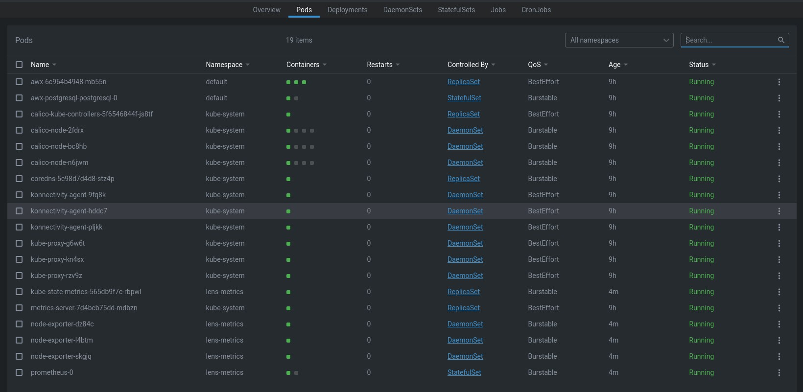
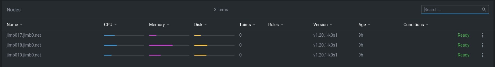
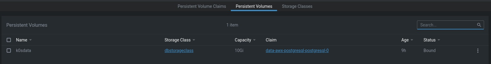
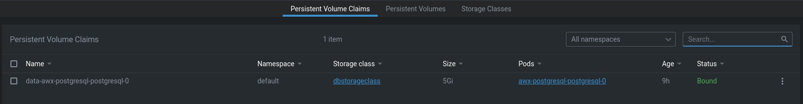
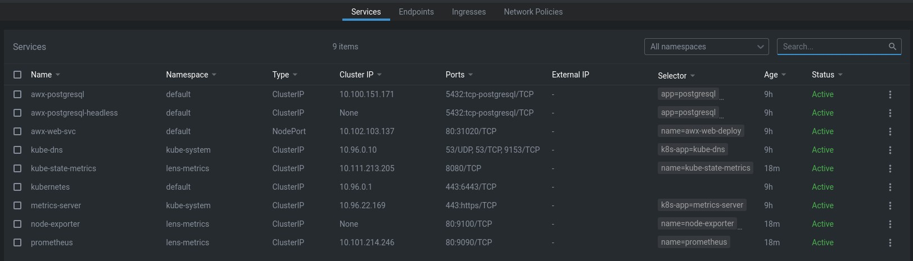

# ansible-kvm-k0s

The goal of this project is to use open software and have Ansible create a lab that is more like a production Kube cluster as possible without using MiniKube.

I am using KVM to create VM's and cloudinit to setup small VM's to then install K0S. Also after that is complete to install Ansible AWX in kube.

There is a controller node and worker nodes in this setup. I don't have a lot of server resources so I have tweaked the AWX installer. I suggest you install Lens for Kube on the system you are using to run Ansible with this code.

https://k0sproject.io/
https://k8slens.dev/

https://github.com/ansible/awx
https://github.com/ansible/awx/blob/devel/INSTALL.md#kubernetes
https://www.ansible.com/

You will need to setup a NFS server for postgresql. You can see the examples in the template dir (exports and exports-permissions.txt).

You will need to create a vault file (vault.yml) have in the file 'ansible_become_password: "yourpassowrd"'.
You will need to rename 'name_vars_example.yml' to 'name_vars.yml' and update the data for 'full_name:', 'passwd:' and 'pub_key:'.

note: There are some debug statements that don't really need to be display. I like to see scrolling data.
